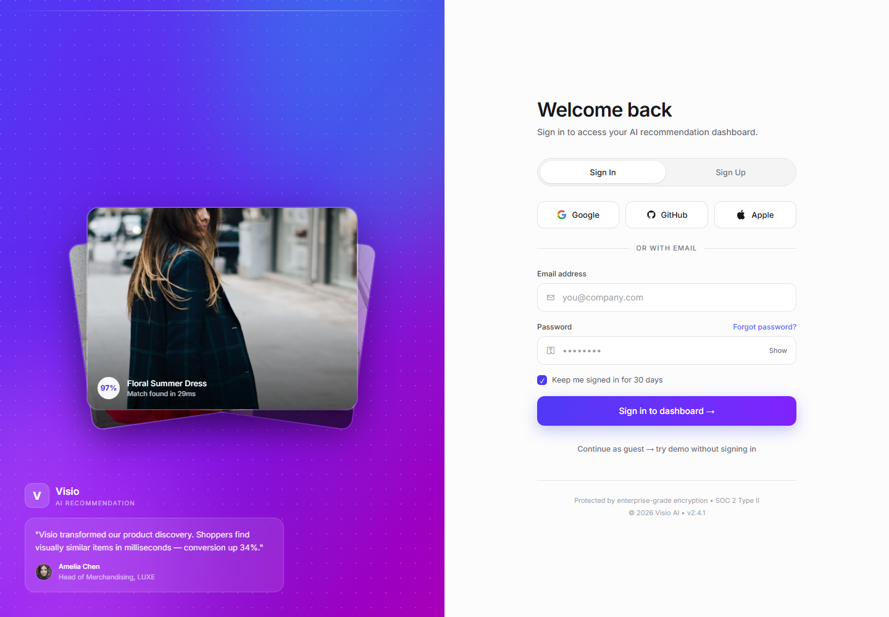

# AI Image Recommendation System

An end-to-end visual product recommendation system that retrieves visually similar fashion products from an uploaded image. It combines EfficientNetB0 feature extraction, FAISS similarity search, a React + Vite frontend, a FastAPI backend, and Supabase authentication and persistence.

## Project Overview

Keyword-based e-commerce search can miss visual attributes such as colour, texture, shape, and design. This project implements an image-based recommendation workflow: it extracts a deep visual embedding from a product image and returns the Top-K closest matches from a pre-indexed product collection.

## Features

- Image-based product search
- EfficientNetB0 feature extraction
- FAISS similarity search for Top-K recommendations
- Responsive React + Vite interface
- FastAPI API layer
- Supabase authentication, user profiles, and recommendation history
- Dataset preparation, embedding generation, and evaluation scripts

## System Architecture

```text
User
  |
  v
React + Vite frontend
  |
  v
FastAPI backend ----> Supabase (authentication and database)
  |
  v
EfficientNetB0 feature extraction
  |
  v
FAISS index
  |
  v
Top-K similar products
```

## Project Structure

```text
AI_Image_Recommendation_System/
├── Frontend/
│   ├── src/
│   │   ├── lib/supabase.ts
│   │   ├── utils/cn.ts
│   │   ├── App.tsx
│   │   ├── SignIn.tsx
│   │   ├── index.css
│   │   └── main.tsx
│   ├── .env.example
│   ├── index.html
│   ├── package.json
│   ├── package-lock.json
│   ├── tsconfig.json
│   └── vite.config.ts
├── src/
│   ├── create_subset.py
│   ├── evaluate.py
│   ├── faiss_index.py
│   ├── generate_embeddings.py
│   ├── prepare_kaggle_dataset.py
│   ├── preprocess.py
│   └── recommendation.py
├── api.py
├── app.py
├── requirements.txt
├── supabase_schema.sql
├── .gitignore
└── README.md
```

### Submission artefact tree

```text
AI_Image_Recommendation_System/
|-- dataset/subset/                 # 120 images: 6 categories x 20
|-- embeddings/
|   |-- embeddings.npy               # (120, 1280)
|   |-- filenames.pkl
|   `-- faiss.index                  # 120 vectors
|-- Frontend/                        # React + Vite client
|-- models/feature_extractor.py      # EfficientNetB0 embedding model
|-- src/                             # preparation, indexing, retrieval scripts
|-- api.py                           # FastAPI upload/recommend endpoint
|-- supabase_schema.sql              # database schema + RLS policies
`-- screenshots/                     # UI evidence for submission
```

> The submission includes a compact 120-image subset and its generated embedding/index artefacts. Larger datasets and regenerated model artefacts should be kept out of Git and reproduced with the supplied scripts.

## Dataset

The project uses the [Fashion Product Images Dataset](https://www.kaggle.com/datasets/paramaggarwal/fashion-product-images-dataset). The included local subset contains **120 images**: 20 each of Casual Shoes, Dresses, Handbags, Jeans, Shirts, and Tshirts. Its generated EfficientNetB0 embeddings have shape **(120, 1280)** and the checked FAISS index has **120 vectors**.

## Technology Stack

| Area | Technologies |
| --- | --- |
| Frontend | React, TypeScript, Vite, Tailwind CSS |
| Backend | FastAPI, Python |
| Recommendation engine | EfficientNetB0, FAISS, NumPy, scikit-learn |
| Image processing | OpenCV, Pillow |
| Authentication and database | Supabase, PostgreSQL |
| Supporting tools | Streamlit, TensorFlow, Keras |

## Installation

### 1. Clone the repository

```bash
git clone https://github.com/sahebkumar-ai/celebal_internship.git
cd celebal_internship/AI_Image_Recommendation_System
```

### 2. Create a virtual environment

```bash
python -m venv .venv
```

### 3. Activate the virtual environment

**Windows (PowerShell)**

```powershell
.\.venv\Scripts\Activate.ps1
```

**macOS/Linux**

```bash
source .venv/bin/activate
```

### 4. Install Python dependencies

```bash
pip install -r requirements.txt
```

### 5. Install frontend dependencies

```bash
cd Frontend
npm install
```

## Environment Variables

Copy `Frontend/.env.example` to `Frontend/.env`, then supply your Supabase and backend values.

```bash
cd Frontend
cp .env.example .env
```

On Windows PowerShell:

```powershell
Copy-Item .env.example .env
```

The frontend expects these variables:

| Variable | Purpose |
| --- | --- |
| `VITE_SUPABASE_URL` | Supabase project URL |
| `VITE_SUPABASE_ANON_KEY` | Supabase anonymous/public key |
| `VITE_API_BASE_URL` | FastAPI backend base URL |

Never commit a populated `.env` file.

## Setup and Usage

### Download and prepare the dataset

1. Download the Fashion Product Images Dataset from Kaggle and extract it locally.
2. Ensure `styles.csv` and `images/` are available in either `kaggle_Data/fashion-dataset/` or `dataset/`.
3. Set `SAMPLES_PER_CATEGORY = 20` in `src/create_subset.py` to reproduce the submission-sized subset (or increase it for a larger experiment), then run:

```bash
python src/prepare_kaggle_dataset.py
python src/create_subset.py
```

### Generate embeddings and build the FAISS index

After preparing the dataset, generate image embeddings and create the search index:

```bash
python src/generate_embeddings.py
python src/faiss_index.py
```

The generated embeddings and FAISS index are included for this compact submission subset; regenerate them after changing the dataset.

### Verified submission artefacts

The submission workspace was verified with 120 source images, 120 saved embeddings, and a 120-vector FAISS index. A local query image returned five recommendations and did not return the query image itself.

### Start the backend

```bash
uvicorn api:app --reload
```

### Start the frontend

```bash
cd Frontend
npm run dev
```

## Evaluation

The included evaluation workflow supports common retrieval measures:

| Metric | Description |
| --- | --- |
| Precision@K | Percentage of relevant products among the Top-K results |
| Recall@K | Portion of relevant products retrieved in the Top-K results |

## Required Supabase setup

1. Create a Supabase project.
2. In **Authentication -> Providers**, enable Email authentication. For a quick demo, disable email confirmation or complete the confirmation email before signing in.
3. In **SQL Editor**, run `supabase_schema.sql`. It creates `profiles`, `recommendation_searches`, `favorites`, and `feedback`, plus row-level-security policies and the profile-creation trigger.
4. Copy `Frontend/.env.example` to `Frontend/.env` and set `VITE_SUPABASE_URL`, `VITE_SUPABASE_ANON_KEY`, and `VITE_API_BASE_URL=http://127.0.0.1:8000`. Do not commit real credentials.

With Supabase unset, visual search still works; sign-in and history/favourites/feedback persistence are unavailable.

## Deployment

| Component | Technology |
| --- | --- |
| Frontend | React + Vite |
| Backend | FastAPI |
| Authentication & Database | Supabase |

## Sample Results

Local UI evidence is included in `screenshots/`.

| Desktop dashboard | Upload-ready state | Mobile dashboard | Sample Result |
| --- | --- | --- | --- |
|  |  | |[Sample Reult]
 |

The multipart API flow was also verified locally: uploading a dataset image to `POST /api/recommend` returned HTTP 200 and five recommendations.

## Future Enhancements

- Multi-image search
- Voice search
- Product bookmarking
- Hybrid recommendations
- Mobile application support
- Multi-language support
- Real-time recommendations and analytics

## Learning Outcomes

This project demonstrates practical application of computer vision, deep learning, image retrieval, feature embeddings, FAISS similarity search, REST API development, authentication, and full-stack AI application development.

## Acknowledgements

- TensorFlow and Keras
- FAISS
- OpenCV
- scikit-learn
- Supabase
- FastAPI
- React
- Kaggle Fashion Product Images Dataset
- EfficientNet research
